# README.md Template

# WAPH-Web Application Programming and Hacking

## Instructor: Dr. Phu Phung

# Project Mini Facebook

# Team members

1. Amit Gaddi, gaddiat@mail.uc.edu
2. Mohan Sai Jasti, jastimi@mail.uc.edu
3. Taraka Ram Annapaneni, annapatm@mail.uc.edu

# Project Management Information

Source code repository (private access): <https://github.com/waph-team3/waph-teamproject>

Project homepage (public): <https://github.com/waph-team3/waph-team3.github.io>

## Revision History

| Date       |   Version     |  Description |
|------------|:-------------:|-------------:|
| 16/04/2024 |  2.0          | Sprint 2   |


# Overview

The WAPH Team Project is a collaborative effort to create a "miniFacebook" online application employing full-stack web development technologies, secure programming techniques, and agile development processes. The project begins with Sprint 0, which is intended to build basic team communication and setup. During this phase, team members are required to become acquainted with one another and the project's objectives, clearly divide work, and rigorously document contributions. Effective cooperation requires the use of communication channels, notably Microsoft Teams, as well as frequent meetings for planning and progress monitoring.Sprint 1 focuses on laying the groundwork for the online application, which includes database design and implementation, user registration, and login capabilities. Logged-in individuals may change their passwords, alter their profiles (including name, extra email, and phone number), and access database postings.

# System Analysis

The goal of constructing a "miniFacebook" online application is to conduct a thorough assessment of the system's needs, functions, and the technological architecture required to meet its objectives. This phase is crucial for assessing the project's scope, selecting the required technology, and organizing the development process using secure programming and agile methodologies. 

## High-level Requirements

The high-level objectives for the WAPH Team Project, which focuses on developing a "miniFacebook" web application, include a variety of functions required to create a user-friendly and secure social networking platform. At its heart, the system must allow users to safely register accounts, verify themselves, and efficiently maintain their profiles. It should enable user interactions by allowing them to connect with friends, exchange posts, photographs, and comments, and manage the privacy settings of their material. Furthermore, the system should be scalable to meet a rising user base, allowing it to manage increased traffic and data quantities effectively. Security is critical, needing strong safeguards such as encryption for sensitive data, secure authentication procedures, and frequent audits to detect and remediate possible flaws. Usability is another critical criterion, requiring an intuitive user interface, smooth navigation, and responsive design to improve the entire user experience. These high-level objectives form the foundation for the creation of a full "miniFacebook" application that satisfies user expectations while following to best practices in web development, security, and user interface design.


# System Design

## Sprint 1
## Use-Case Realization

   * Implement user registration functionality
   * Develop user login system
   * Enable users to change their passwords
   * Allow users to edit their profiles (name, additional email, phone)
   * Enable logged-in users to view posts from the database

## Database 

   * Refine database design based on Sprint 1 requirements
   * Implement database schema for user management and posting features
   * Populate users table with sample data for testing

## User Interface

   * Design and implement user registration form
   * Develop login form for user authentication
   * Create UI elements for password change and profile editing
   * Design post viewing interface for logged-in users

# Security analysis


*  How did you apply the security programming principles in your project?
To maintain a safe and trustworthy system, we followed a number of security programming standards throughout this project. We guaranteed the security and integrity of data in transit by integrating session management with PHP sessions and secure communication over HTTPS. Input validation is done implicitly, and SQL queries are prepared to prevent SQL injection threats. Furthermore, hashing passwords (albeit it is inferred rather than expressly stated that hashing is performed before saving passwords in the database) and using HTTPS (indicated by the secure cookie feature) are consistent with the ideas of least privilege and defense in depth.


*  What database security principles have you used in your project?
We used prepared statements for database interactions to successfully avoid SQL Injection attacks, which are an important part of database security. The notion of least privilege is demonstrated by the use of a specific database user ('team3') with presumably restricted rights customized to the application's needs. Password hashing is suggested, which improves data at rest security by guaranteeing that saved credentials are not in plain text.  


*  Is your code robust and defensive? How?
The code exhibits defensive programming principles by checking session integrity (for example, matching the session's user agent to prevent session hijacking) and using prepared statements to avoid SQL injection. While more complete input validation and error handling would improve resilience, current features such as rigorous session management and secure cookie parameters (HTTPOnly and Secure flags) help to support a defense-in-depth approach.  


*  How did you defend your code against known attacks such as XSS, SQL Injection, CSRF, Session Hijacking
XSS (Cross-Site Scripting): The usage of htmlentities() when repeating user input (for example, the username) reduces XSS risks by encoding potentially hazardous characters.
    SQL Injection: Prepared statements in SQL queries protect against injection by isolating SQL code from data.
    CSRF (Cross-Site Request Forgery): While not expressly stated, using secure session management procedures indirectly helps to reduce CSRF vulnerabilities. Using CSRF tokens in forms would be a straightforward measure.
    Session Hijacking: Checking the user agent string consistency throughout a session aids in the detection and defense against session hijacking attempts. The Secure flag on cookies guarantees that cookies are exclusively transferred via HTTPS, which reduces the danger of interception.


*   How do you separate the roles of super users and regular users?
The offered code samples do not explicitly explain role separation. However, establishing role-based access control (RBAC) often entails defining roles in the database and assigning users to their appropriate responsibilities. Access control choices can then be made programmatically depending on the role(s) assigned to the presently authenticated user. This might include conditional checks inside the application logic to determine if a user can access particular features or activities based on their role.


# Demo (screenshots)
## Sprint 0  
* A screenshot demo for the login page working on the HTTPS team's local domain  
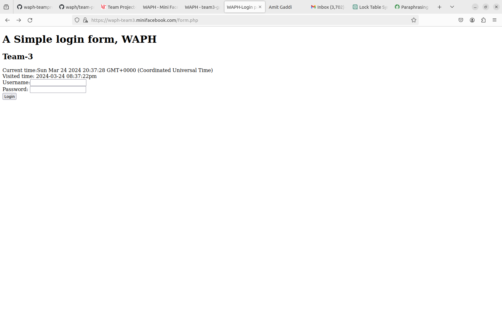

* A screenshot demo for the welcome page working on the HTTPS team's local domain  
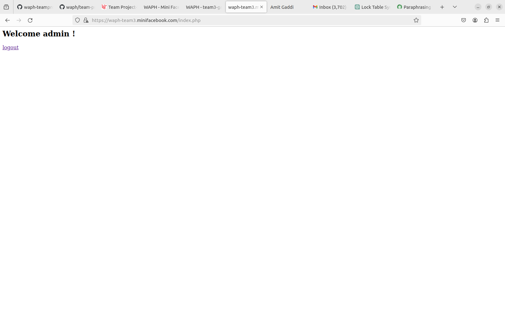

* A screenshot demo for the logout page working on the HTTPS team's local domain  
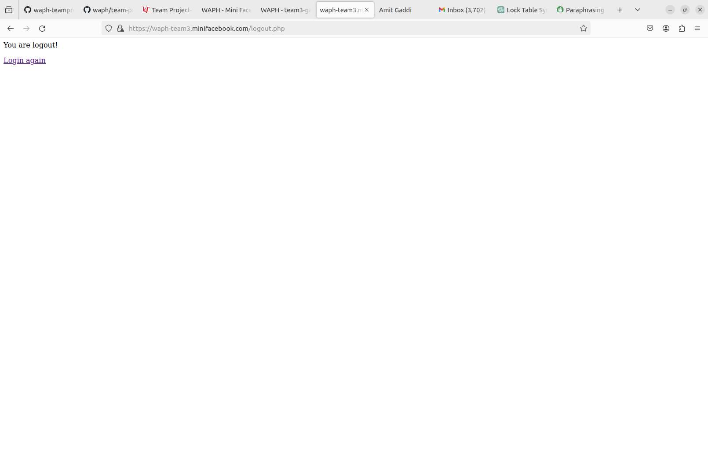

* One screenshot demo for each team member of the index.html page on the HTTPS team's local domain  
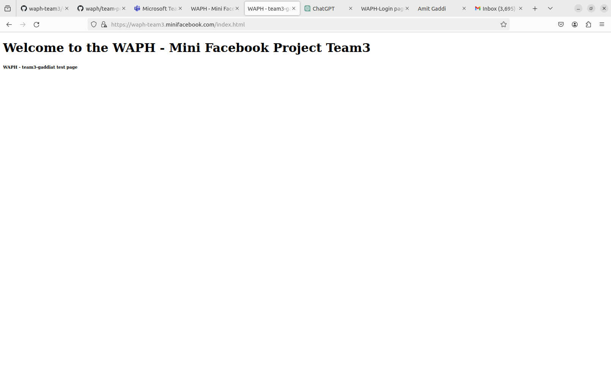
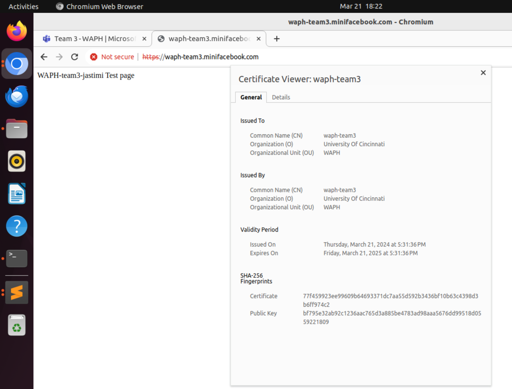
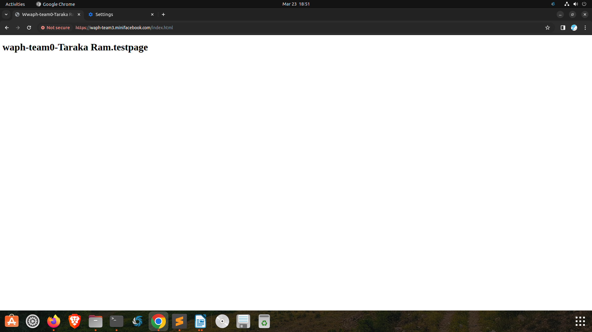

## Sprint 1  


* A index page showing the posts from database.  


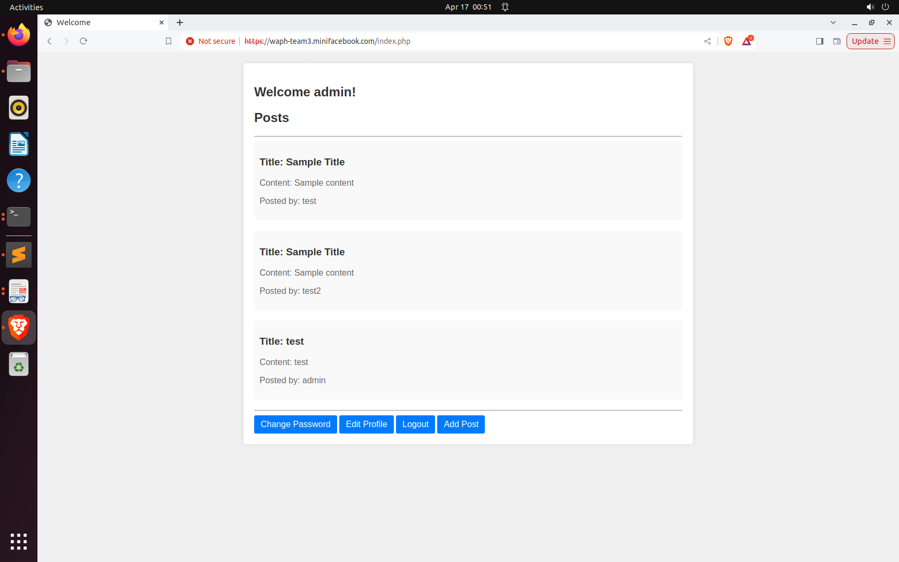  


* A screenshot that shows the user can change password.  


* Screenshots showcasing the edit profile functionalities.  


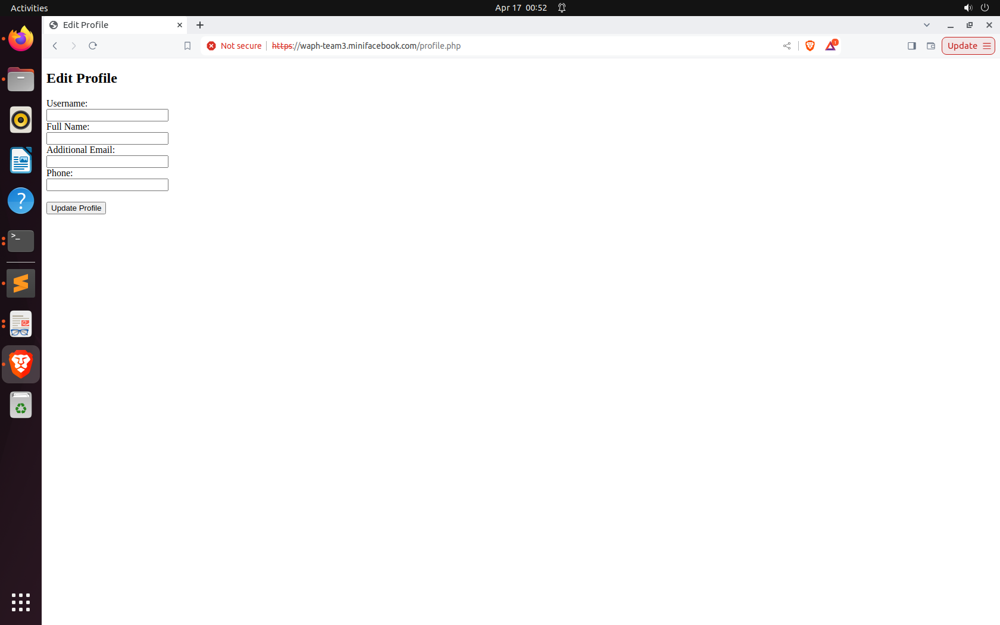  


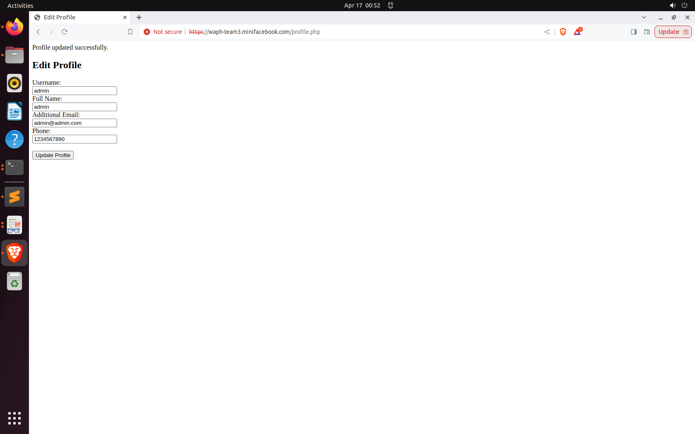

## Sprint 2

* A index page showing the posts and comments from database.  


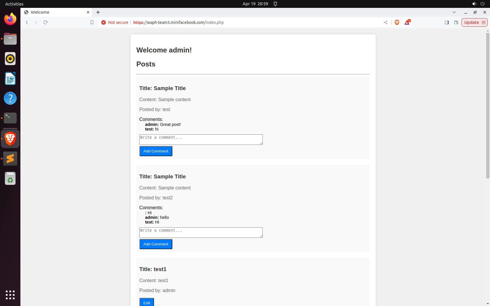  


* A index page showing the posts and comments from database and edit and deletion option only to the owner of that post.  

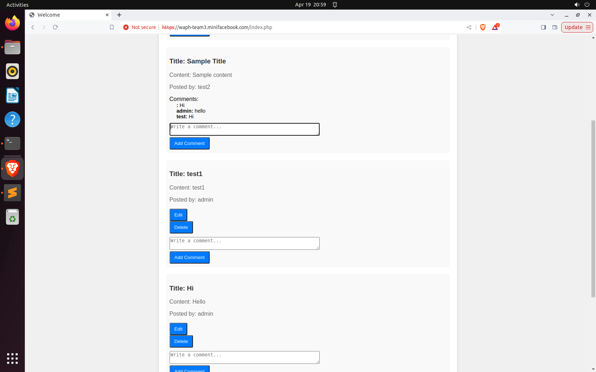


* Screenshots showcasing the edit post functionalities.  


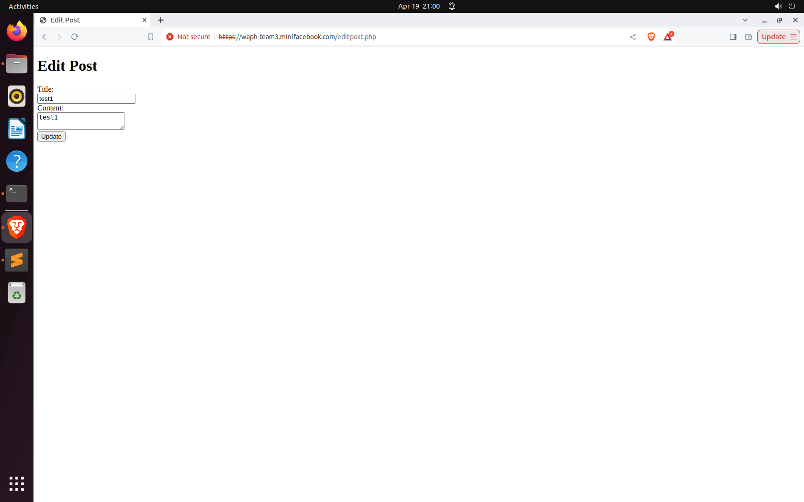 


# Software Process Management

We employed an agile software management approach, especially Scrum, to successfully lead our cooperation and communication for our project, which was centered on creating the "miniFacebook" web application with three individuals. As part of our Scrum strategy, we divided our project into sprints, each lasting one to two weeks. During sprint planning sessions, we describe the tasks that must be accomplished, rank them according to their significance and dependencies, and assign them to specific team members. This ensures that each team member understands their duties and the sprint's goals. Throughout the sprint, we conduct frequent synchronous meetings, to review progress, handle any issues or roadblocks, and alter our plans as necessary. These sessions also serve as chances for cooperation, allowing team members to exchange ideas, offer feedback, and help each other complete their jobs. We utilize collaboration platforms like Microsoft Teams to communicate, share information, and coordinate our work. In addition, we manage our codebase using version control platforms like as Git and GitHub, which allow for seamless collaboration, versioning, and code review procedures. By adopting the Scrum process and cultivating a culture of cooperation and communication, our team ensures that we stay flexible, adaptive, and focused on producing a high-quality product that fulfills project needs and stakeholder expectations.

## Scrum process

### Sprint 0

Duration: 19/03/2024-24/03/2024

#### Completed Tasks: 

1. Organization Setup on GitHub
2. Member Contributions to Team Organization
3. Team SSL Key/Certificate Setup
4. Design and Setup of Team Database
5. Code Skeleton Copy and Revision

#### Contributions: 

1. Amit, 8 commits, 4 hours, contributed in All the tasks.
2. Mohan, 8 commits, 4 hours, contributed in Tasks - 2 to 5.
3. Taraka , 8 commits, 4 hours, contributed in Tasks - 2 to 5.


#### Sprint Retrospection:


| Good     |   Could have been better    |  How to improve?  |
|----------|:---------------------------:|------------------:|
|Helpful team members |Prioritizing tasks|Conduct task estimation|

* Prioritizing Tasks: To enhance task prioritizing, we may use a systematic methodology like a prioritization matrix or the MoSCoW method. This will allow us to identify and prioritize tasks that are vital to the project's success.

* Conduct assignment Estimation: We understood the significance of appropriately assessing the time and effort necessary for each assignment. To improve this process, we may use approaches like as story points or time-based estimates to ensure that jobs are properly scoped and planned for completion within the sprint period.

### Sprint 1

Duration: 25/03/2024-31/03/2024

#### Completed Tasks: 

1. Database Design and Implementation
2. User Registration Functionality
3. User Login Functionality
4. Password Change Feature
5. Profile Editing Feature (Name, Additional Email, Phone)
6. Viewing Posts from the Database


#### Contributions: 

1. Amit, 6 commits, 5 hours, contributed in All the tasks.
2. Mohan, 6 commits, 5 hours, contributed in All the tasks.
3. Taraka , 6 commits, 5 hours, contributed in All the tasks.


#### Sprint Retrospection:


| Good     |   Could have been better    |  How to improve?  |
|----------|:---------------------------:|------------------:|
|Well-defined tasks |More detailed testing|Set clearer deadlines|


### Sprint 2

Duration: 08/04/2024-16/04/2024

#### Completed Tasks: 

1. Database Design and Implementation 
2. Permitting logged-in users to create new posts and comment on any existing posts
3. Allowing logged-in users to modify (edit or delete) their own posts
4. Ensuring that users cannot edit posts authored by other users


#### Contributions: 

1. Amit, 6 commits, 4 hours, contributed in All the tasks.
2. Mohan, 6 commits, 4 hours, contributed in All the tasks.
3. Taraka , 6 commits, 4 hours, contributed in All the tasks.


#### Sprint Retrospection:

| Strengths     |   Opportunities for Improvement    |  Suggestions for Enhancement  |
|---------------|:----------------------------------:|------------------------------:|
|Effective team collaboration |Task prioritization   |Implement task estimation techniques|


# Appendix

Include the content (in text, not as images) of the SQL files and all source code of your PHP files (with the file name). 
Included `database-data.sql`

```sql
-- if the table exists, delete it
DROP TABLE IF EXISTS users;

-- create a new table
CREATE TABLE users(
    username VARCHAR(100) PRIMARY KEY,
    password VARCHAR(100) NOT NULL,
    fullname VARCHAR(100),
    otheremail VARCHAR(100),
    phone VARCHAR(15)
);

-- insert data to the table users

INSERT INTO users(username, password) VALUES ('admin', md5('123'));
INSERT INTO users(username, password) VALUES ('test', md5('test'));

DROP TABLE IF EXISTS posts;

CREATE TABLE posts(
    postID VARCHAR(100) PRIMARY KEY,
    title VARCHAR(100) NOT NULL,
    content VARCHAR(100),
    posttitle VARCHAR(100),
    owner VARCHAR(100),
    FOREIGN KEY (owner) REFERENCES users (username) ON DELETE CASCADE
);

-- if the table exists, delete it
DROP TABLE IF EXISTS comments;

-- create a new table
CREATE TABLE comments(
    commentID VARCHAR(100) PRIMARY KEY,
    content VARCHAR(255) NOT NULL,
    postID VARCHAR(100),
    commenter VARCHAR(100),
    FOREIGN KEY (postID) REFERENCES posts (postID) ON DELETE CASCADE,
    FOREIGN KEY (commenter) REFERENCES users (username) ON DELETE CASCADE
);

-- if the table exists, delete it
DROP TABLE IF EXISTS super_users;

-- create a new table
CREATE TABLE super_users (
    username VARCHAR(100) PRIMARY KEY,
    password VARCHAR(100) NOT NULL,
    fullname VARCHAR(100),
    email VARCHAR(100)
);


```


Included `database-account.sql`

```sql
create database waph_team;
create user 'team3'@'localhost' IDENTIFIED BY '1234';
grant ALL on waph_team.* TO 'team3'@'localhost';
```

Included `index.php`

```php
<?php
    
    //session_set_cookie_params(15*60,"/","192.168.33.128"TRUE,TRUE);
    session_set_cookie_params([
        'lifetime' => 15*60,
        'path' => '/',
        'domain' => 'waph-team3.minifacebook.com',
        'secure' => TRUE,
        'httponly' => TRUE
    ]);

    session_start();  

    if (isset($_POST["username"]) and isset($_POST["password"])){
        if (checklogin_mysql($_POST["username"],$_POST["password"])) {
            $_SESSION['authenticated'] = TRUE;
            $_SESSION['username'] = $_POST["username"];
            $_SESSION['browser'] = $_SERVER["HTTP_USER_AGENT"];
        }else{
            session_destroy();
            echo "<script>alert('Invalid username/password');window.location='form.php';</script>";
            die();
        }
    }
    if (!isset($_SESSION['authenticated']) or $_SESSION['authenticated'] != TRUE) {
        session_destroy();
        echo "<script>alert('You have not loggedin,please login first!')</script>";
        header("Refresh: 0; url=form.php");
        die();
    }

    if ($_SESSION['browser'] != $_SERVER["HTTP_USER_AGENT"]) {
    session_destroy();
    echo "<script>alert('Session hijacking is detected')</script>";
    header("Refresh: 0; url=form.php");
    die();
}


    function checklogin_mysql($username, $password) {
        $mysqli = new mysqli('localhost','team3','1234','waph_team');
        if($mysqli->connect_errno){
            printf("Database connection failed: %s\n", $mysqli->connect_errno);
            exit();
        }
        $sql = "SELECT * FROM users WHERE username=? AND password = md5(?)";
        $stmt = $mysqli->prepare($sql);
        $stmt->bind_param("ss", $username, $password);
        $stmt->execute();
        $result = $stmt->get_result();
        if($result->num_rows ==1)
            return TRUE;
        return FALSE;
    }

?>
        <h2> Welcome <?php echo htmlentities($_SESSION['username']); ?> !</h2>
        <a href="logout.php">logout</a>
```


Included `form.php`

```php
<!DOCTYPE html>
<html lang="en">
<head>
  <meta charset="utf-8">
  <title>WAPH-Login page</title>
  <script type="text/javascript">
      function displayTime() {
        document.getElementById('digit-clock').innerHTML = "Current time:" + new Date();
      }
      setInterval(displayTime,500);
  </script>
</head>
<body>
  <h1>A Simple login form, WAPH</h1>
  <h2>Team-3</h2>
  <div id="digit-clock"></div>  
<?php
  //some code here
  echo "Visited time: " . date("Y-m-d h:i:sa")
?>
  <form action="index.php" method="POST" class="form login">
    Username:<input type="text" class="text_field" name="username" /> <br>
    Password: <input type="password" class="text_field" name="password" /> <br>
    <button class="button" type="submit">Login</button>
  </form>
</body>
</html>
```

Included `logout.php`

```php
<?php
session_start();
session_destroy();
?>
<p> You are logout! </p>

<a href="form.php">Login again</a>
```

Included `index.html`

```html
<!DOCTYPE html>
<html lang="en">
<head>
    <meta charset="UTF-8">
    <meta name="viewport" content="width=device-width, initial-scale=1.0">
    <title>WAPH - Mini Facebook Project</title>
    <style>
        body {
            font-family: Arial, sans-serif;
            margin: 0;
            padding: 0;
            /* Adjust layout here */
            display: flex;
            flex-direction: column; /* This aligns items in a column */
            align-items: center; /* This centers the items horizontally */
        }
        .member {
            margin: 20px;
            text-align: center;
        }
        .member img {
            width: 150px;
            height: 150px;
            border-radius: 50%;
            object-fit: cover;
        }
        .member a {
            display: inline-block;
            margin-top: 10px;
            text-decoration: none;
            color: #007BFF;
        }
    </style>
</head>
<body>
<h1>Welcome to the WAPH - Mini Facebook Project Team3</h1>
<br>
<div class="member">
    
    <h3>Amit</h3>
    <p>Email: gaddiat@mail.uc.edu</p>
    <p>Short-bio: Amit has keen interests in IT.</p>
    <a href="https://gaddiat.github.io/" target="_blank">Personal Homepage</a>
</div>
<br>
<div class="member">
    
    <h3>Mohan</h3>
    <p>Email: jastimi@mail.uc.edu</p>
    <p>Short-bio: Mohan has keen interests in web development and DevOps.</p>
    <a href="https://jastimi.github.io/" target="_blank">Personal Homepage</a>
</div>
<br>
<div class="member">
    
    <h3>Taraka Ram Annpaneni</h3>
    <p>Email: annapatm@mail.uc.edu.com</p>
    <p>Short-bio: Tarak is passionate on Software development and Cloud technologies.</p>
    <a href="https://annapatm.github.io/" target="_blank">Personal Homepage</a>
</div>
<br>
</body>
</html>
```

